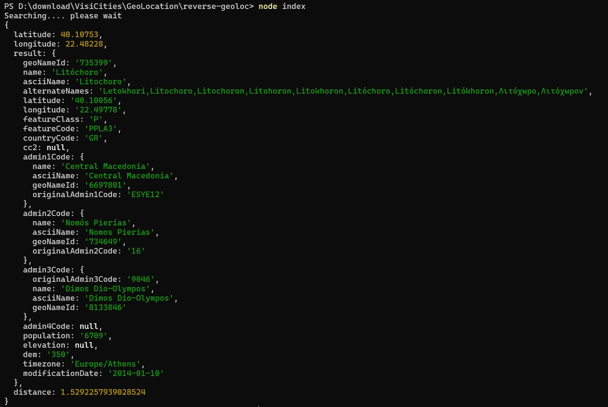

# OffLine-ReverseGeolocation
Simple offline reverse geolocation using CSV files. Written with javascript. Currently, the only country it supports is Greece, but you can easily modify the code inside `reverse-geloc.js` to apply for your own country.

The application initially  downloads the country selected from the https://download.geonames.org/export/dump/ website and automatically creates a local `data` folder. It unzips the downloaded file and then it starts the coordinates search inside the CSV. For that reason, it will take a while only for the 1st time to return the JSON object result. Be patient. 

# How to install and run the example

Install the modules with ```npm install``` and run ```node index```

# How to use it in your application.

Import the module ie ```var reverseGeoLoc = require('./reverse-geoloc')```

Call the module
```
 console.log("Searching.... please wait");
 reverseGeoLoc(40.10753, 22.48228, (err, data) => {

  if (err)
    console.log("Error :", err)
  else
    console.log(data)
 });
```


